# Aktualizator stanu magazynowego

## Spis Treści
1. [Etap 0 - Wprowadzenie](#Wprowadzenie)
2. [Etap I - Strona startowa](#Homepage)
3. [Etap II - Strona logowania](#Loginpage-Registerpage)
4. [Etap III - Aplikacja](#Aplikacja)
   1. [Strona główna - Lista wpisów](#Lista-wpisów)
   2. [Podstrona - Profil](#Profil)
   3. [Podstrona - Dodaj wpis](#Dodaj_wpis)
   4. [Podstrona - Zarządzaj](#Zarządzaj)
   5. [Podstrona - Admin](#Admin)

---

## Wprowadzenie

Aplikacja to aktualizator stanów magazynowych w firmie zajmującej się brażną e-commerce MK18. Jest ona tworzona z myślą o pracownikach magazynu firmy MK18, spersonalizowana w taki sposób aby zgadzała się ze wszystkimi wymogami i parametrami produktów magazynu.

Strona startowa "homepage" to niewielka wizytówka firmy i wprowadzenie do tematu, natomiast po przejściu do panelu logowania będziemy mogli utworzyć konto, a następnie po zalogowaniu korzystać z aplikacji. Wprowadzone zostanie również zabezpieczenie, które wiązać się będzie z tym, że tylko pracownicy firmy będą mogli korzystać z aplikacji. 

Podstawowe funkcjonalności aplikacji to:

* Dodawanie wpisów dotyczących zmian na magazynie
* Filtrowanie po wpisach
* Usuwanie wpisów
* Eksport i import bazy wpisów
* Panel admina z możliwością zarządzania użytkownikami

Użytkownicy aplikacji każdego dnia po zakończeniu pracy będą zapisywać obecną zawartość wpisów z danego dnia, eksportować do pliku xls z domyślną nazwą - datą danego dnia. W ten sposób zgodnie z prośbą ustaloną z góry na temat tej funkcjonalności logi w postaci wpisów z poprzednich dni będą zapisywane do plików. Zawartość listy wpisów z aplikacji natomiast zostanie wtedy wyczyszczona, a następnego dnia pracownicy ponownie będą uzupełniali listę wpisów (aktualizacji magazynowych). W każdej chwili będzie możliwość wczytania w aplikacji wpisów z poprzednich dni.

Lista wpisów oraz użytkowników, a także zarządzanie danymi z tych list jest oparte o zewnętrzne bazy danych oraz SQL.

## Homepage

Poniżej znajduje się prezentacja strony startowej, która jest wizytówką całej aplikacji webowej. Z tej strony można przejść na oficjalną stronę MK18, a także skorzystać z opcji logowania i rejestracji. Strona jest także responsywna, dostosowana do urządzeń pc o różnych rozdzielczościach.

Tak przedstawia się górny fragment strony:

W ten sposób wygląda pozostała część wraz ze stopką:

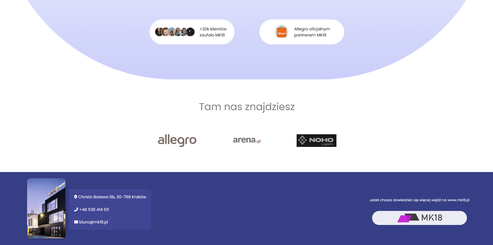

Strona startowa powinna również być responsywna jeżeli chodzi o urządzenia mobilne. Skorzystałem z "media query" i stworzyłem innych styl strony dla rozdzielczości mniejszych od 768px.
Jest to z styl stworzony z myślą o tabletach, ale przede wszystkim telefonach.

Przedstawia się on w następujący sposób:

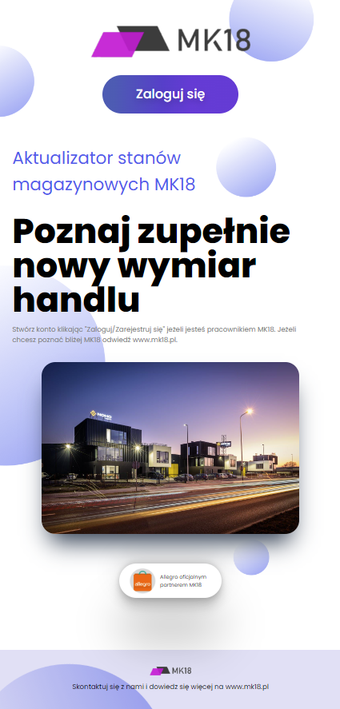

## Loginpage-Registerpage

Poniższe zrzuty ekranu prezentują interfejs obsługujący stronę logowania i rejestracji użytkownika. Bardzo istotnym elementem jest to aby potwierdzić czy osoba zakładająca konto to pracownik. Pracownicy otrzymają od przełożonego specjalny identyfikator, który pozwoli im na rejestrację. Zrzuty przedstawiają responsywny widok strony logowania i rejestracji na PC, a także urządzeniu mobilnym.

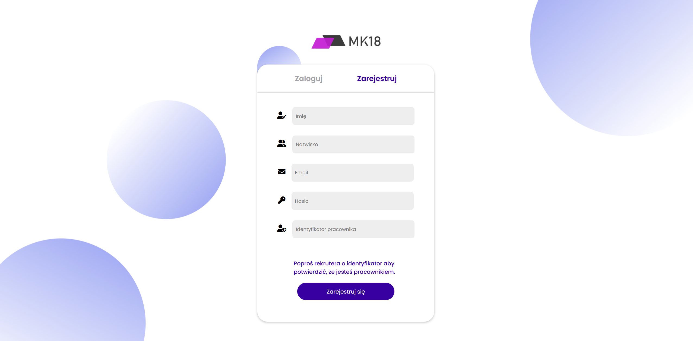

W ten sposób wygląda to na urządzeniach mobilnych:

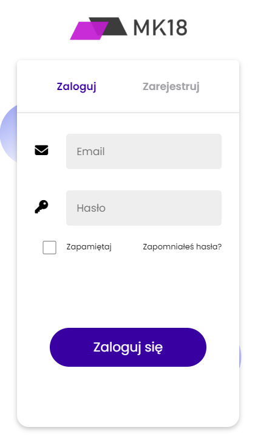

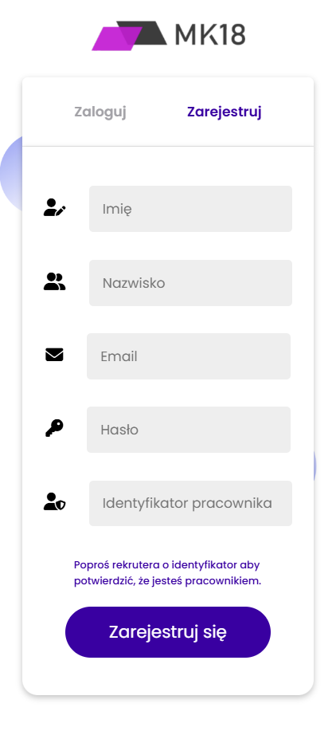

## Aplikacja 
### Lista-wpisów

W lewej części ekranu znajduje się nasz panel nawigacyjny w postaci menu. Główną stroną aplikacji jest "Lista wpisów". Na stronie tej lądują domyślnie wszyscy użytkownicy po zalogowaniu.
Jest to lista wszystkich obecnych wpisów. Wyświetlana tabela przedstawia wpisy użytkowników z obecnego dnia.
Informacje zawarte w każdym wpisie to:

* Użytkownik
* ID
* Lokalizacja
* Ilość

Wyświetlany w danym wierszu użytkownik jest odpowiedzialny za wpis, wprowadza on ID produktu, a także Lokalizację produktu na magazynie za pomocą laserowego czytnika kodów kreskowych.
Ilość to wartość mówiąca o tym ile produktów zostało dodanych do danej Lokalizacji lub zabranych z niej jeżeli występuje w postaci liczby ujemnej.
W ostatniej kolumnie nazwanej jako "Akcja" znajduje się interaktywne pole "Usuń" pozwalające na usuwanie wpisów. Opcja edycji obecnych wpisów została odrzucona zgodnie z ideą tworzenia historii akcji gdyż historia powinna zawierać wszelkie działania jakie miały miejsce na produktach. Usuwanie wpisów służy sytuacji, w której użytkownik się pomylił.

Pozostałe elementy w centralnej części strony to:

* Wyszukiwarka, która pozwala nam na filtrowanie wpisów w czasie rzeczywistym po każdym z kryteriów wpisu.
* Dwa bloki informacyjne wyświetlające obecną ilość wpisów i liczbę zarejestrowanych użytkowników.
* Dane obecnie zalogowanego w danej sesji użytkownika w rogu ekranu.

Istotnym elementem jest podstrona nazwana "Admin". Jest to podstrona widoczna tylko przez użytkowników mających prawa administratora.

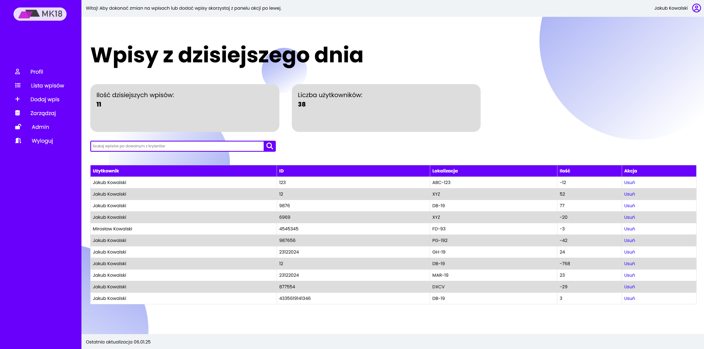

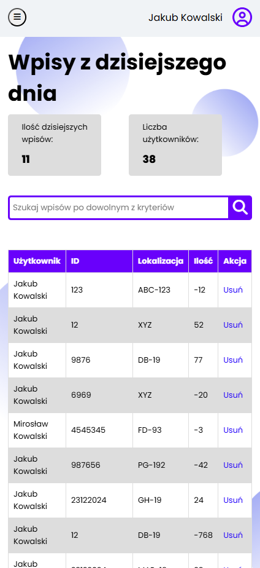

### Profil

Podstrona Profil pozwala użytkownikowi na zmianę jego Imienia i Nazwiska.
Dane te są aktualizowane w bazach powiązanych z projektem, a także na liście wpisów.
Jeżeli na liście wpisów widnieją wpisy wprowadzone przez użytkownika, który właśnie zmienił swoje dane to dane te na liście wpisów na stronie głównej również zostają zaktualizowane.

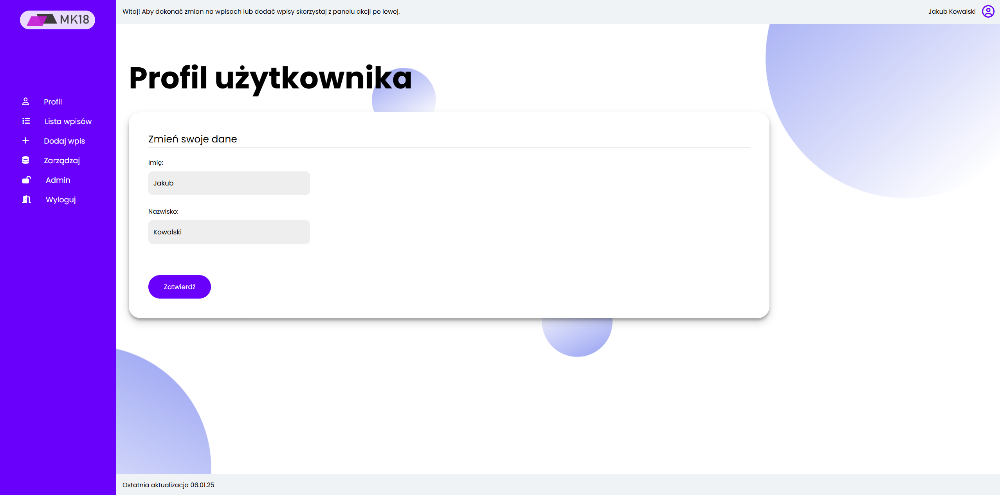

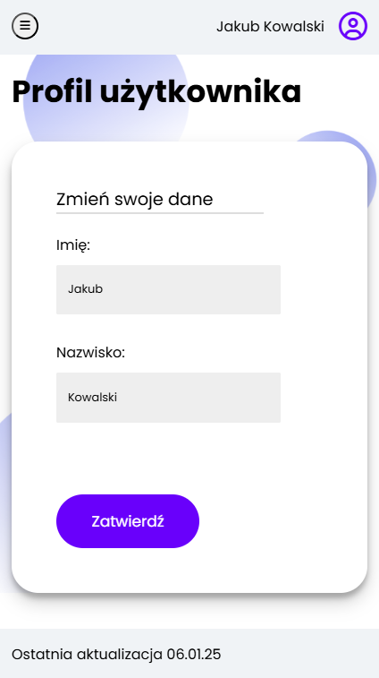

### Dodaj_wpis

Strona ta prezentuje najważniejszą funkcję całego projektu pozwalającą na dodawania wpisów do tabeli wpisów.
Przed dodaniem wpisu musimy uzupełnić pola o wymagane informacje.
Dodane zostało również zabezpieczenie odnośnie walidacji danych przy uzupełnianiu pól.

Domyślnie po wejściu na stronę skrypt automatycznie wchodzi w pole ID tak aby użytkownik mógł od razu zacząć uzupełniać pole bez uprzedniego klikania w nie.
Funkcjonalność ta sprzyja łatwemu i wygodnemu uzupełnianiu pól przy pomocy laserowego skanera kodów kreskowych.

Pole "Ilość" znajduje się wśród przycisków, które również zapewniają wygodniejszą pracę przy dodawaniu wpisów dla użytkowników korzystających z urządzeń mobilnych.
Pole to oczywiście może być uzupełniane ręcznie bez korzystania z przycisków.

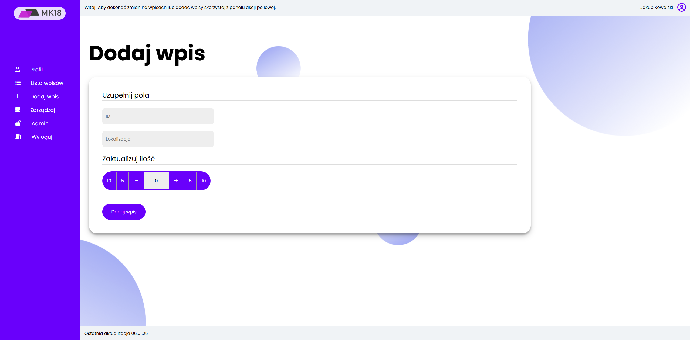

### Zarządzaj

Podstrona "Zarządzaj" posiada dwie funkcjonalności:

* Eksport
* Import

Eksport pozwala użytkownikom na wyeksportowanie bazy listy wpisów do pliku xls. Plik zapisywany jest z datą z dnia obecnego w nazwie
Domyślna nazwa pliku jest zapisywana jako: **Wpisy_dzisiejsza_data.xls**. Plik taki może być oczywiście zmodyfikowany lub po prostu dodany do dokumentacji i zachowany jako historia wpisów z danego dnia.

Import natomiast pozwala na zaimportowanie plików w formatach:

* xls
* xlsx

Aplikacja następnie zamienia obecną listę wpisów ze strony główną listą, która została zaimportowana.
Opcja dodania zaimportowanych wpisów do wpisów obecnych została odrzucona ze względu na istotę podziału wpisów ze względu na różne dni.

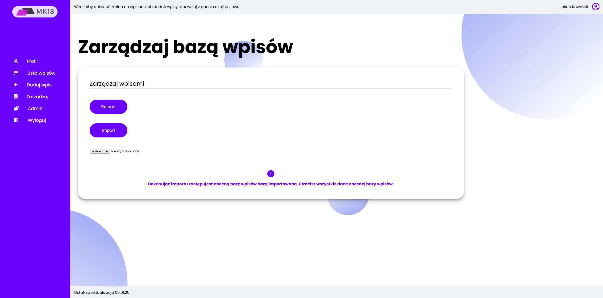

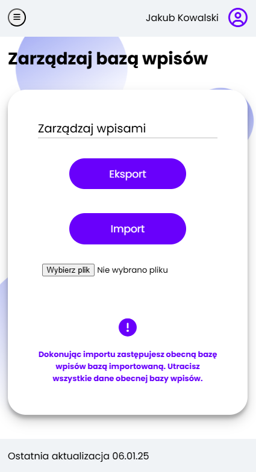

### Admin

Ostatnia już podstrona to panel admina, do którego mają dostęp tylko użytkownicy posiadający prawa administratora.
Admin na tej stronie może skorzystać z pięciu różnych funkcji zarządzania użytkownikami:

* Zablokowanie użytkownika
* Odblokowanie użytkownika
* Nadanie praw administratora użytkownikowi
* Odebranie praw administratora użytkownikowi
* Usunięcie konta użytkownika

Przy każdej z tych opcji znajduje się rozwijana lista z użytkownikami. 
Przy opcji bloday i odblokowywania użytkowników dodatkowo znajdują się widoki wyświetlające listę użytkowników spełniających określony stan.
W rozwijanych listach również wyświetlają się tylko użytkownicy, którzy spełniają dany stan tzn. w liście użytkowników możliwych do odblokowania wyświetlą się tylko użytkownicy zablokowani.

Przy przyciskach znajdują się symbole znaków zapytania, które po wcisnięciu wyświetlają podpowiedzi typu tooltip.

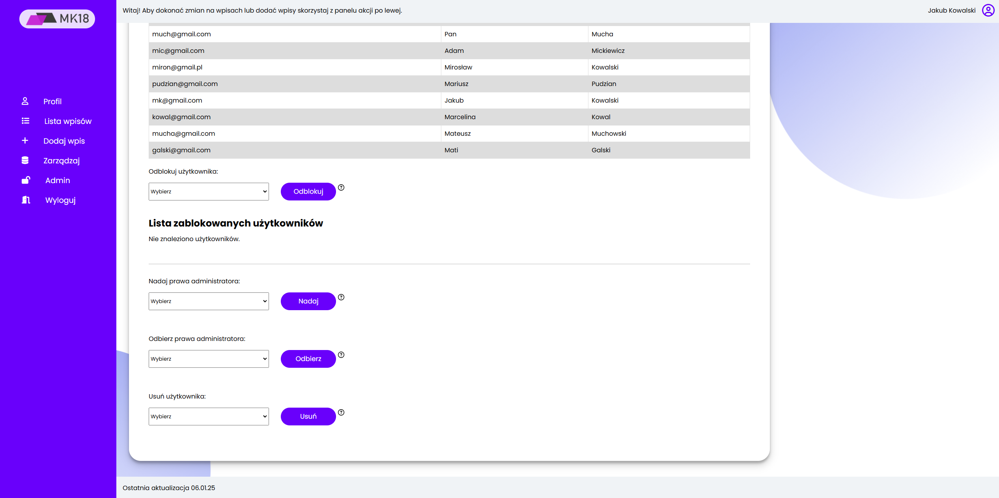

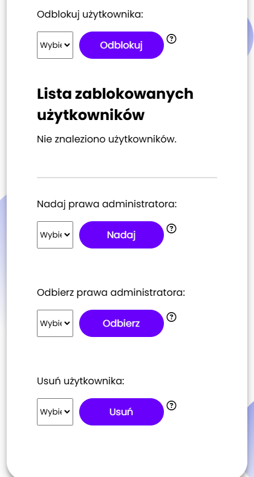